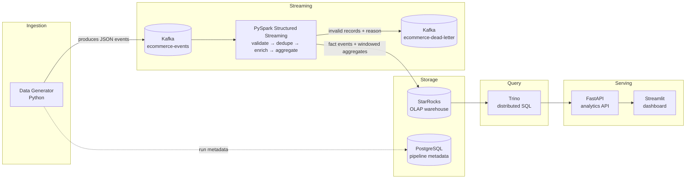

# Real-Time E-Commerce Data Platform

A production-style real-time data engineering platform that ingests
e-commerce events through Apache Kafka, processes them with PySpark
Structured Streaming, stores analytical data in StarRocks, enables
distributed SQL analytics through Trino, and exposes business metrics
through a FastAPI service and a Streamlit dashboard.

Built as a portfolio project to demonstrate real streaming data-engineering
architecture end to end - not a toy tutorial, and not a claim of production
scale. See [docs/architecture.md](docs/architecture.md#what-this-project-does-not-claim)
for what this project honestly does and does not claim.

## 1. Project Overview

**The business problem:** an e-commerce company wants near-real-time
visibility into revenue, product performance, conversion funnels, and
customer behavior, computed continuously from a stream of clickstream and
transaction events (views, cart activity, purchases, payments, refunds,
logins) rather than from a nightly batch report.

This platform simulates that event stream, processes it continuously, and
serves the resulting metrics through both a REST API and a live dashboard.

## 2. Architecture



A more detailed breakdown of every component, the full data-flow walkthrough,
windowing/watermark choices, and failure-mode behavior lives in
[docs/architecture.md](docs/architecture.md).

## 3. Technology Stack

| Technology | Why it's here |
|---|---|
| **Apache Kafka** | Durable, replayable, ordered-per-key buffer decoupling the event generator from the stream processor. |
| **PySpark Structured Streaming** | Stateful, watermarked, windowed processing (validation, dedup, aggregation) with checkpointed fault tolerance. |
| **StarRocks** | Columnar OLAP warehouse built for the aggregation-heavy query pattern this project's metrics need. |
| **PostgreSQL** | Small transactional store for pipeline run metadata - not a duplicate of the analytical data. |
| **Trino** | Distributed SQL query engine, used as a single federated query interface over StarRocks. |
| **FastAPI** | Typed REST layer over Trino queries, with a repository/service architecture. |
| **Streamlit** | The human-facing dashboard, itself just an API client. |
| **Docker Compose** | Runs and networks all nine services locally with one command. |
| **Pydantic** | Event schema definition and validation on the producer side. |
| **pytest** | 32 tests covering generation, data quality, transformations, and the API. |

Full rationale for each choice (including trade-offs, not just upsides) is in
[docs/architecture.md's "Design decisions"](docs/architecture.md#design-decisions).

## 4. Features

- Realistic synthetic event generator with a genuine product-view-heavy
  funnel distribution, deterministic seeding, and deliberate injection of
  malformed (~2%) and duplicate (~3%) events to exercise quality/dedup paths.
- Independent schema validation in Spark (not just trusting the producer),
  with a Kafka dead-letter topic carrying the specific failure reason.
- Watermarked exactly-event_id deduplication, bounded by a configurable
  watermark delay.
- Four independent windowed streaming aggregations: revenue, event volume,
  product performance (with conversion rate), and geographic breakdown.
- A star-schema-inspired StarRocks data model with table-model choices
  (Primary Key vs. Duplicate Key) matched to each table's actual write
  pattern - see [docs/data-model.md](docs/data-model.md).
- Federated SQL access through Trino, with a runnable query library in `sql/`.
- A typed, layered FastAPI service (routes → services → repositories) with
  structured logging, request timing, and graceful 503s when the analytical
  layer is unreachable.
- A Streamlit dashboard covering overview KPIs, revenue trends, product
  performance, user behavior, and the conversion funnel.
- 32 pytest tests, all runnable without the full Docker stack for the
  generator/API tests (see [docs/troubleshooting.md](docs/troubleshooting.md)
  for the one JDK-version caveat on the Spark tests).

## 5. Project Structure

```
data_generator/    Event/user/product generation + Kafka producer + Postgres run-metadata logging
spark/              Structured Streaming job: schemas, validation, transformations, windowed aggregations
starrocks/          Database/table DDL (init/) and dimension-seeding script (seed/)
trino/catalog/      Trino catalog config pointing at StarRocks
postgres/init/      Auto-applied PostgreSQL metadata schema
sql/                Runnable analytical SQL queries (revenue, product, customer, funnel)
api/                FastAPI service: routes → services → repositories → Pydantic response models
dashboard/          Streamlit app + per-section components, backed only by the FastAPI client
tests/              pytest suite for the generator, data quality, transformations, and API
scripts/            setup.sh, health_check.sh, generate_sample_data.py
docs/               architecture, data model, troubleshooting, learning guide, interview prep, resume bullets
```

Two intentional deviations from a maximal structure, explained rather than
silently made: there is no separate top-level `data_quality/` package
(`spark/data_quality.py` already is the reusable validation module, used by
both the streaming job and its own test file) and no `starrocks/schemas/`
directory (DDL lives in `starrocks/init/`, which is what actually gets
executed) - see [docs/data-model.md](docs/data-model.md) for the reasoning
behind every "why is X not here" schema decision.

## 6. Prerequisites

- **Docker Desktop** (or Docker Engine + Compose v2) - this is the only hard
  requirement to run the platform.
- **Python 3.11+** - only needed for running tests locally or the
  no-Kafka sample generator script outside Docker.
- **Git**.

No local Kafka, Spark, StarRocks, or Trino installation is required -
everything runs in containers.

## 7. Setup

```bash
git clone <this-repo>
cd real-time-ecommerce-data-platform
cp .env.example .env        # adjust values if you need non-default settings
```

`.env.example` documents every configurable value (event rate, malformed/
duplicate rates, window/watermark durations, credentials, ports). Defaults
are safe for local use out of the box.

## 8. Running the System

The scripted path:

```bash
./scripts/setup.sh
```

Or step by step (what the script does, in order - useful because several
services genuinely need to finish initializing before the next step can
succeed):

```bash
# 1. Build custom images
docker compose build

# 2. Start core infra and wait for it to be healthy
docker compose up -d kafka postgres starrocks

# 3. Create Kafka topics (one-shot)
docker compose up kafka-init

# 4. Apply the StarRocks schema (one-shot; StarRocks needs ~60-120s to become healthy first)
docker compose up starrocks-init

# 5. Seed the users/products dimension tables (run from the host, needs Python + requirements.txt)
python -m starrocks.seed.seed_dimensions

# 6. Start Trino, the streaming job, the generator, the API, and the dashboard
docker compose up -d trino spark-streaming data-generator api dashboard kafka-ui
```

Then open:

- **Dashboard:** http://localhost:8501
- **API docs (Swagger UI):** http://localhost:8000/docs
- **Kafka UI:** http://localhost:8081
- **Trino:** http://localhost:8080

Expect a **few minutes** before the dashboard's windowed metrics show
non-zero data: raw events land in StarRocks within seconds, but each
windowed aggregate is only finalized once its watermark passes (default:
window duration + 2 minutes). See
[docs/troubleshooting.md](docs/troubleshooting.md#no-data-shows-up-in-the-dashboard)
if it takes longer than that.

## 9. API Documentation

Interactive Swagger docs are always available at `/docs` once the API is
running. Endpoints:

| Endpoint | Description |
|---|---|
| `GET /health` | Service + Trino connectivity status. |
| `GET /metrics/revenue?days=14` | Revenue summary, daily trend, revenue by country. |
| `GET /metrics/events` | Total events, active users, breakdown by event type. |
| `GET /metrics/products?limit=50` | Per-product views/cart-adds/purchases/revenue/conversion rate. |
| `GET /metrics/countries` | Event count and revenue by country. |
| `GET /metrics/devices` | Event count by device type. |
| `GET /metrics/funnel` | product_view → add_to_cart → purchase funnel with conversion rates. |
| `GET /metrics/top-products?limit=10` | Top products by revenue. |

Example:

```bash
curl "http://localhost:8000/metrics/revenue?days=7"
curl "http://localhost:8000/metrics/funnel"
```

## 10. Example SQL Queries

Runnable directly through Trino:

```bash
trino --server localhost:8080 --catalog starrocks --schema ecommerce \
  --file sql/revenue.sql
```

See `sql/revenue.sql`, `sql/product_analytics.sql`,
`sql/customer_analytics.sql`, and `sql/funnel_analysis.sql` for the full
query library (total/daily/hourly revenue, top products, conversion rates,
declining-sales detection, per-session funnels, and more).

## 11. Data Flow

See [docs/architecture.md's "Data flow: the life of one event"](docs/architecture.md#data-flow-the-life-of-one-event)
for the full numbered walkthrough from `data_generator` publishing a message
to it appearing on the dashboard.

## 12. Design Decisions

Why Kafka, why Spark (not plain Python), why StarRocks (not just
PostgreSQL), and why Trino in front of StarRocks (including the real,
documented JDBC-driver quirk this required working around) are all explained
with their trade-offs in
[docs/architecture.md's "Design decisions"](docs/architecture.md#design-decisions).

## 13. Scaling Considerations

What would actually change moving from this project's ~20 events/sec local
setup toward a hypothetical 10,000 events/sec: Kafka partition/replication
changes, a real Spark cluster instead of `local[*]`, switching the StarRocks
write path from JDBC to Stream Load/the native Spark connector, and adding a
caching layer in front of Trino. None of this is implemented here - it's
documented in [docs/architecture.md's "Scaling considerations"](docs/architecture.md#scaling-considerations-20-eventssec---10000-eventssec)
because reasoning about it is what the architecture is meant to demonstrate.

## 14. Failure Scenarios

What happens if Kafka goes down, StarRocks goes down, a malformed event
arrives, a duplicate event arrives, Spark restarts, or the API can't reach
Trino - each with the actual mechanism (not just "it's handled") - is in
[docs/architecture.md's "Failure scenarios" table](docs/architecture.md#failure-scenarios).

## 15. Future Improvements

Realistic next steps, explicitly **not** implemented in this repository:

- A schema registry (Avro/Protobuf + Confluent Schema Registry) to enforce
  the event contract at the Kafka layer itself, not just downstream in Spark.
- Cloud deployment (managed Kafka, a real Spark cluster, managed StarRocks/
  object storage).
- Stronger observability: metrics export (Prometheus/Grafana) instead of
  log-based counters, and distributed tracing across the pipeline.
- Orchestration (e.g. Airflow) for the currently-manual dimension-seeding
  step and any future batch-shaped jobs.
- CI/CD running the test suite and building images on every push.
- Kubernetes deployment for the Spark job and API/dashboard.
- Data lineage tracking across the Kafka → Spark → StarRocks → Trino chain.

---

## Learning Resources

- **[docs/learning-guide.md](docs/learning-guide.md)** - every concept used
  in this project (Kafka partitions/consumer groups, Spark transformations/
  actions/shuffles, Structured Streaming watermarks/windows/checkpointing,
  StarRocks table models, Trino connectors, and core data-engineering
  concepts like ETL vs. ELT and exactly-once vs. at-least-once), each tied
  to the exact file/line where it's used in this codebase.
- **[docs/interview-preparation.md](docs/interview-preparation.md)** - 56
  interview questions (beginner, intermediate, project-specific), each with
  a short answer, a detailed explanation, and how it maps to this project -
  including two real bugs hit and fixed while building it.
- **[docs/resume-description.md](docs/resume-description.md)** - resume
  bullets and technology list, written to only claim what's actually
  implemented.

## Running Tests

```bash
pip install -r requirements.txt
pytest -v
```

32 tests covering the generator, Spark data-quality/transformation logic,
and the API (with Trino mocked). The Spark-dependent tests need a JDK 11 or
17 on `PATH` - see
[docs/troubleshooting.md](docs/troubleshooting.md#running-tests-locally-without-the-full-docker-stack)
if you hit a `java.lang.reflect`/`UnsupportedOperationException` error on a
newer JDK.

## License

This is a personal portfolio project; no license is specified.
