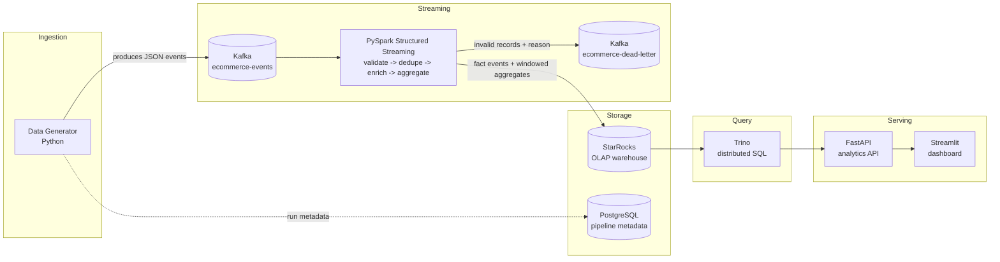

# Architecture

## Overview

The platform simulates a continuous stream of e-commerce customer activity and
turns it into queryable business metrics with sub-minute latency. It is built
from eight cooperating services, each with a single, well-defined job:

## Component responsibilities

| Component | Responsibility |
|---|---|
| **Data Generator** | Simulates users, products, and a realistic event funnel; publishes JSON to Kafka; occasionally emits malformed/duplicate events to exercise the quality and dedup paths. |
| **Kafka** | Durable, ordered, replayable event log. Decouples the generator's write rate from Spark's processing rate. |
| **PySpark Structured Streaming** | Validates, deduplicates, normalizes, enriches, and aggregates the event stream in micro-batches; writes results to StarRocks and routes invalid records to the dead-letter topic. |
| **StarRocks** | Columnar OLAP warehouse. Stores the raw event fact table and four pre-aggregated metrics tables, optimized for fast analytical queries. |
| **PostgreSQL** | Small operational store for pipeline run metadata (start/stop times, event counts) and dashboard configuration - explicitly *not* a duplicate of the analytical data. |
| **Trino** | Distributed SQL query engine used as the single query interface for both the API and ad-hoc analysis (`sql/*.sql`), federating through StarRocks' MySQL-compatible protocol. |
| **FastAPI** | Thin, typed HTTP layer over Trino queries, with a repository/service split so SQL never leaks into route handlers. |
| **Streamlit** | Human-facing dashboard, itself just a client of the FastAPI service. |

## Data flow: the life of one event

1. `data_generator` builds an `EcommerceEvent` (or a deliberately malformed
   payload) and publishes it to the `ecommerce-events` Kafka topic, keyed by
   `user_id` so a user's events land on one partition and stay ordered.
2. Spark's Structured Streaming query reads the topic as an unbounded
   DataFrame, parses the JSON payload against the expected schema, and runs
   it through `spark/data_quality.py`.
3. Records that fail validation are written, with their failure reason
   attached, to the `ecommerce-dead-letter` topic - nothing is dropped
   silently.
4. Records that pass validation are deduplicated by `event_id` within a
   watermarked state store (bounding memory use on an unbounded stream), then
   normalized (`spark/transformations.py`): countries/devices are
   canonicalized, `total_amount` is derived, and date/hour fields are added.
5. The clean, enriched stream is written to StarRocks' `events` fact table,
   and simultaneously aggregated into four windowed metrics
   (`revenue_metrics`, `event_volume_metrics`, `product_metrics`,
   `geo_metrics`), each written continuously as its own streaming query.
6. Trino queries StarRocks on demand. The FastAPI service wraps a fixed set
   of these queries behind typed REST endpoints.
7. The Streamlit dashboard polls the API every `DASHBOARD_REFRESH_SECONDS`
   and renders the result.

## Windowing choices

- **Window duration (default 1 minute)**: short enough to feel "real-time" on
  a dashboard refreshing every 15 seconds, long enough that a window contains
  a meaningful number of events even at the default 20 events/sec generation
  rate.
- **Watermark delay (default 2 minutes)**: bounds how long Spark keeps a
  window's state open waiting for late data, and therefore how much memory
  the dedup/aggregation state stores use. Two minutes comfortably covers
  the kind of delay a local Docker network introduces, while still bounding
  state within a few window lengths.
- **Output mode**: the raw fact-table write uses `append` (a row is finalized
  the moment it is validated). The four windowed aggregations use `update`
  (each micro-batch re-emits every window whose total changed) because a
  window's totals are legitimately incomplete until its watermark passes.
  This is what motivates StarRocks' Primary Key table model for the
  `*_metrics` tables: repeated `update`-mode writes for the same window
  upsert cleanly instead of accumulating duplicate partial-total rows.

## Design decisions

**Why Kafka?** It is the standard durable, replayable buffer between
producers and stream processors, and it lets the event generator and the
Spark job scale, fail, and restart independently. Partitioning by `user_id`
gives per-user ordering guarantees for free.

**Why Spark Structured Streaming (not plain Python)?** The pipeline needs
stateful, watermarked, windowed aggregation and exactly-once-per-micro-batch
sink writes - functionality a hand-rolled Python consumer would have to
reimplement (and get wrong) from scratch. Structured Streaming's DataFrame
API also keeps validation, dedup, and aggregation logic testable as pure
functions (see `tests/test_transformations.py`), independent of Kafka.

**Why StarRocks (not just PostgreSQL)?** The workload here is
analytical/aggregation-heavy (`SUM`, `GROUP BY`, windowed rollups) over an
append-heavy, high-cardinality fact table - the textbook case for a columnar
OLAP engine. PostgreSQL is retained, but scoped to what it's actually good at:
small, transactional operational metadata.

**Why Trino in front of StarRocks, instead of querying StarRocks directly?**
Two reasons, both real rather than resume-driven: (1) it demonstrates the
federated-query pattern that is Trino's whole reason to exist - the API layer
talks to one query interface regardless of how many backends it later grows
to include; (2) it decouples the API's SQL dialect from StarRocks specifics.
The trade-off, documented honestly: StarRocks has no official Trino
connector, so this project uses Trino's `mysql` connector against StarRocks'
MySQL-wire-protocol port (see `trino/catalog/starrocks.properties`). This
works for the read-only analytical queries this project needs, but it took
real debugging to get there rather than working out of the box: StarRocks
reports its wire protocol as MySQL version "5.1.0", which sends the MySQL
JDBC driver's `INFORMATION_SCHEMA`-based table discovery down a code path
that only returned StarRocks' VIEWs, not its BASE TABLEs - `SHOW TABLES`
through Trino returned just the `purchases` view. The fix
(`mysql.jdbc.use-information-schema=false`, forcing legacy `SHOW`-based
metadata calls instead) is a pragmatic workaround, not a purpose-built
integration - a production system might query StarRocks directly instead,
or use a proper connector if one is required for other reasons.

## Scaling considerations (20 events/sec -> 10,000 events/sec)

The current setup runs everything as a single Docker Compose stack on one
machine, which is appropriate for a portfolio project but has an obvious
ceiling. What would actually need to change at 500x the volume:

- **Kafka**: increase `ecommerce-events` partitions well beyond 6 (partition
  count bounds consumer parallelism) and run a multi-broker cluster with
  `replication_factor > 1` for durability.
- **Spark**: move from `local[*]` to a real cluster (e.g. Spark on
  Kubernetes/YARN) so partitions are processed across multiple executors
  instead of threads on one container; increase `spark.sql.shuffle.partitions`
  in step with cluster size.
- **StarRocks writes**: switch from the JDBC `foreachBatch` sink used here to
  StarRocks' native Stream Load or the official Spark connector, which are
  built for high-throughput bulk ingestion and would meaningfully outperform
  row-by-row JDBC inserts at this scale.
- **StarRocks storage**: add BE nodes and increase bucket counts on the fact
  table so ingestion and query load spread across more compute.
- **API/dashboard**: add a caching layer (or pre-materialize common queries)
  in front of Trino so dashboard polling doesn't recompute aggregates from
  raw events on every refresh.

None of this is implemented in this repository - it is documented here
because being able to reason about it is exactly what the architecture is
meant to demonstrate.

## Failure scenarios

| Failure | Behavior |
|---|---|
| **Kafka is down** | The generator's producer retries with `acks=all` and buffers in its internal queue; if the outage outlasts the buffer, `produce()` raises and is logged - events are not silently lost, but a long outage does cause loss of the in-flight buffer. The Spark job's Kafka source will fail its micro-batch and, under `restart: unless-stopped`, the container restarts and resumes from Spark's checkpointed offsets. |
| **StarRocks is down** | Spark's `foreachBatch` JDBC write throws, failing that micro-batch; Structured Streaming does not advance its checkpointed offset past a failed batch, so the same data is retried on the next trigger once StarRocks recovers - no data is skipped. |
| **A malformed event arrives** | `spark/data_quality.py` flags it during validation and it is routed to `ecommerce-dead-letter` with a reason code, instead of crashing the job or being silently dropped. |
| **A duplicate event arrives** | `deduplicate_events()` drops it via `dropDuplicates(["event_id"])` under a watermark, as long as it arrives within the watermark window of the original. |
| **Spark restarts** | Each streaming query recovers from its own checkpoint directory (`/opt/spark-checkpoints/<query>`), replaying only the offsets it had not yet committed. |
| **The API cannot reach Trino** | Every repository call is wrapped by `AnalyticsService._safe`, which converts the failure into an `AnalyticsUnavailableError` and the route returns HTTP 503 with a clear message, instead of a raw 500 or a hang. `GET /health` also reports `trino_reachable: false` so the dashboard can show a warning banner. |

## What this project does *not* claim

This is a local Docker Compose deployment generating tens of events per
second, not a production system. It demonstrates the architecture and
mechanics of exactly-once-per-batch, watermarked stream processing at a
scale that is honestly testable on a laptop - it does not claim to have
processed billions of events, run in production, or guarantee zero data
loss under all failure modes.
